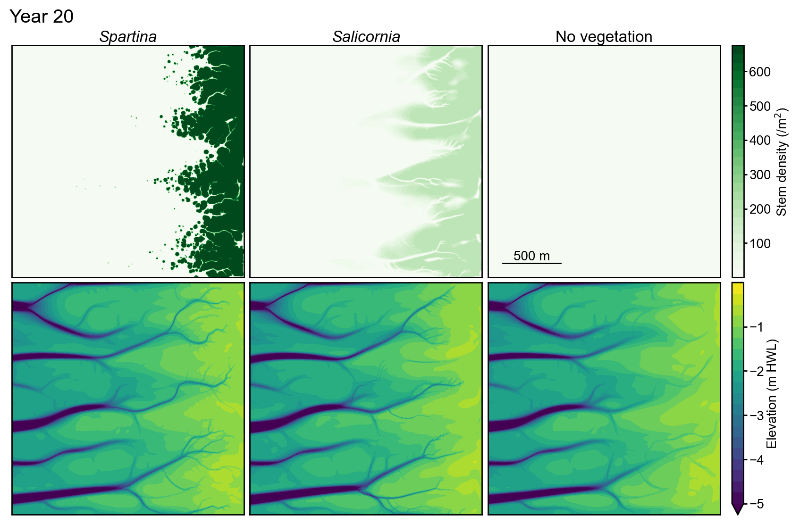

# Demeter

**Biogeomorphic modeling of coastal wetlands:** Couples vegetation dynamics with hydro-morphodynamics to study saltmarsh and mangrove evolution.

[](https://youtu.be/oSzcoR9WBtI)
*Click the image to watch 200 years of coastal landscape evolution with Demeter.*

## Installation
```bash
pip install git+https://github.com/ogourgue/demeter.git
```
- **Requirements:** Python 3.6+, numpy, scipy, matplotlib, mpi4py (auto-installed)
- **For Telemac integration** (optional):
  - Install [Telemac](http://wiki.opentelemac.org/doku.php?id=installation_on_linux) (supported versions: v8p2r0, v8p2r1 - more coming soon)
  - Install [pputils](https://codeberg.org/pprodano/pputils):
  ```bash
  git clone https://codeberg.org/pprodano/pputils.git
  export PYTHONPATH="${PYTHONPATH}:/path/to/pputils"
  ```

## Citation

If you use Demeter in your research, please cite:

Gourgue, O., Belliard, J.P., Xu, Y.Y., Kleinhans, M.G., Fagherazzi, S., Temmerman, S. (2024), Dense vegetation hinders sediment transport toward saltmarsh interiors, Limnology and Oceanography Letters, 9(6), 764-775 ([https://doi.org/10.1002/lol2.10436](https://doi.org/10.1002/lol2.10436))

## Contact and support

[Start a discussion](https://github.com/ogourgue/demeter/discussions) - Questions, ideas, or feedback  
[Report issues](https://github.com/ogourgue/demeter/issues) - Bug reports and feature requests
